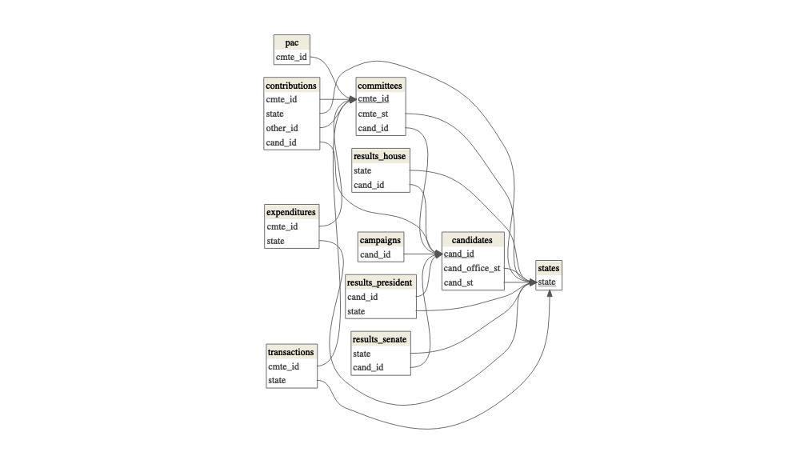

<!-- README.md is generated from README.Rmd. Please edit that file -->


```{r, include = FALSE}
knitr::opts_chunk$set(
  collapse = TRUE,
  comment = "#>",
  fig.path = "man/figures/README-",
  out.width = "100%"
)
```


# fec12 </img>


**fec20** contains data from the [Federal Election Commission (FEC)](https://www.fec.gov/) website pertaining to candidates, committees, results, contributions from committees and individuals, and other financial [data for the United States 2019-2020 election cycle](https://www.fec.gov/data/browse-data/?tab=bulk-data). Additionally, for the datasets that are included as samples, the package includes functions that import the full versions.


## Installation

Get the development version from GitHub:

```{r, eval = FALSE}
# If you haven't installed the remotes package yet, do so:
# install.packages("remotes")
remotes::install_github("lindsaypoirier/fec20")
```

```{r message=FALSE, warning=FALSE}
# Load package
library(fec20)
```


## Datasets Included

### Full Datasets

- `candidates`: candidates registered with the FEC during the 2015-2016 election cycle
- `committees`: committees registered with the FEC during the 2015-2016 election cycle
- `campaigns`: the House/Senate current campaigns
- `results_house`: the House results of the 2016 general election
- `results_senate`: the Senate results of the 2016 general election
- `results_president`: the final results of the 2016 general election
- `pac`: Political Action Committee (PAC) and party summary financial information
- `states`: geographical information about the 50 states

### Sample Datasets (with 1000 random rows each)

- `individuals`: individual contributions to candidates/committees during the 2020 election cycle
- `contributions`: candidates and their contributions from committees during the 2020 election cycle
- `expenditures`: the operating expenditures 
- `transactions`: transactions between committees

## Functions Included

The following functions retrieve the entire datasets for the sampled ones listed above. The size of the raw file that is downloaded by calling each function is given for reference. All functions have an argument `n_max` which defaults to the entire dataset but the user can specify the max length of the dataset to be loaded via this argument.

- `read_all_individuals()` \~ 5GB
- `read_all_contributions()` \~ 212MB
- `read_all_expenditures()` \~ 757.8MB
- `read_all_transactions()` \~ 2.4GB

## How is the data relational?

The headers of each table show the dataset name. The underlined variables are **primary keys** while all the others are **foreign keys**. The arrows show how the datasets are connected. 



The diagram is built using the `dm` R package. The code can be found in `data-raw/dm.R`.

## Examples

### Data Wrangling 

`fec20` can be used to summarize data in order see how many candidates are running for elections (in all offices) for the two major parties:

```{r, message=FALSE}
library(dplyr)

data <- candidates %>%
  filter(cand_pty_affiliation %in% c("REP", "DEM")) %>%
  group_by(cand_pty_affiliation) %>%
  summarize(size = n())

data
```

### Data Visualization 

We can visualize the above data:

```{r, include=FALSE}
set.seed(21)
```


```{r party-plot, message=FALSE, warning=FALSE}
library(ggplot2)

ggplot(data, aes(x = cand_pty_affiliation, y = size, fill = cand_pty_affiliation)) +
  geom_col() +
  labs(
    title = "Number of Candidates Affiliated with the Two Major Parties",
    x = "Party", y = "Count", fill = "Candidate Party Affiliation"
  )
```

## See Also

If you are interested in political data, check out the following related packages:

- [`politicaldata`](https://github.com/elliottmorris/politicaldata/)
- [`ProPublicaR`](https://github.com/dietrichson/ProPublicaR)

## Contributors

 - [Marium Tapal](https://github.com/mariumtapal)
 - [Irene Ryan](https://github.com/ireneryan)
 - [Rana Gahwagy](https://github.com/ranawg)
 - [Benjamin S. Baumer](https://github.com/beanumber)
