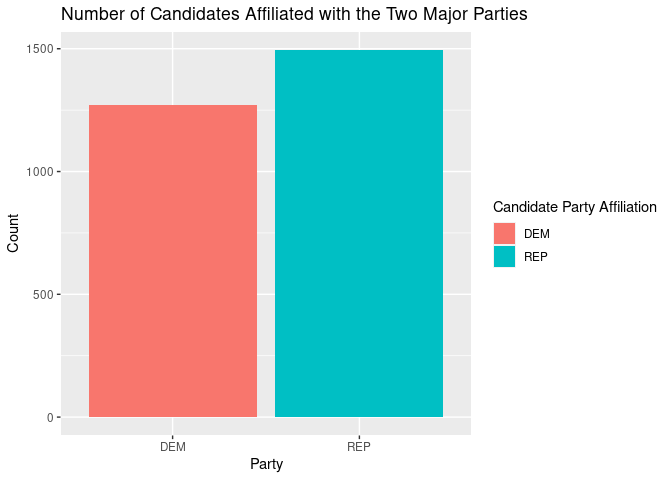

<!-- README.md is generated from README.Rmd. Please edit that file -->

# fec16 

<!-- badges: start -->

[](https://www.tidyverse.org/lifecycle/#maturing)
[](https://CRAN.R-project.org/package=fec16)
[](https://travis-ci.org/baumer-lab/fec16)
[](https://www.r-pkg.org:443/pkg/fec16)
<!-- badges: end -->

**fec16** contains data from the [Federal Election Commission
(FEC)](https://www.fec.gov/) website pertaining to candidates,
committees, results, contributions from committees and individuals, and
other financial [data for the United States 2015-2016 election
cycle](https://www.fec.gov/data/browse-data/?tab=bulk-data).
Additionally, for the datasets that are included as samples, the package
includes functions that import the full versions.

## Installation

Get the latest released version from CRAN:

``` r
install.packages("fec16")
```

Or the development version from GitHub:

``` r
# If you haven't installed the remotes package yet, do so:
# install.packages("remotes")
remotes::install_github("baumer-lab/fec16")
```

``` r
# Load package
library(fec16)
```

## Datasets Included

### Full Datasets

  - `candidates`: candidates registered with the FEC during the
    2015-2016 election cycle
  - `committees`: committees registered with the FEC during the
    2015-2016 election cycle
  - `campaigns`: the House/Senate current campaigns
  - `results_house`: the House results of the 2016 general election
  - `results_senate`: the Senate results of the 2016 general election
  - `results_president`: the final results of the 2016 general election
  - `pac`: Political Action Committee (PAC) and party summary financial
    information

### Sample Datasets (with 1000 random rows each)

  - `individuals`: individual contributions to candidates/committees
    during the 2016 election cycle
  - `contributions`: candidates and their contributions from committees
    during the 2016 election cycle
  - `expenditures`: the operating expenditures
  - `transactions`: transactions between committees

## Functions Included

The following functions retrieve the entire datasets for the sampled
ones listed above. The size of the raw file that is downloaded by
calling each function is given for reference. All functions have an
argument `n_max` which defaults to the entire dataset but the user can
specify the max length of the dataset to be loaded via this argument.

  - `read_all_individuals()` \~ 1.45GB
  - `read_all_contributions()` \~ 15.4MB
  - `read_all_expenditures()` \~ 52.1MB
  - `read_all_transactions()` \~ 79.2MB

## Examples

### Data Wrangling

`fec16` can be used to summarize data in order see how many candidates
are running for elections (in all offices) for the two major parties:

``` r
library(dplyr)

data <- candidates %>%
  filter(cand_pty_affiliation %in% c("REP", "DEM")) %>%
  group_by(cand_pty_affiliation) %>%
  summarize(size = n())

data
#> # A tibble: 2 x 2
#>   cand_pty_affiliation  size
#>   <chr>                <int>
#> 1 DEM                   1270
#> 2 REP                   1495
```

### Data Visualization

We can visualize the above data:

``` r
library(ggplot2)

ggplot(data, aes(x = cand_pty_affiliation, y = size, fill = cand_pty_affiliation)) +
  geom_col() +
  labs(
    title = "Number of Candidates Affiliated with the Two Major Parties",
    x = "Party", y = "Count", fill = "Candidate Party Affiliation"
  )
```



## Contributors

  - [Marium Tapal](https://github.com/mariumtapal)
  - [Irene Ryan](https://github.com/ireneryan)
  - [Rana Gahwagy](https://github.com/ranawg)
  - [Benjamin S. Baumer](https://github.com/beanumber)
