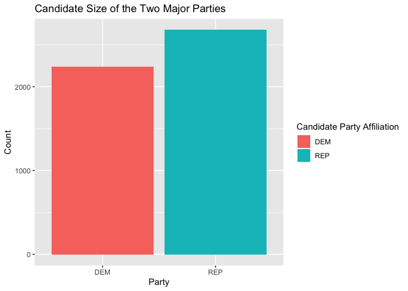

<!-- README.md is generated from README.Rmd. Please edit that file -->

# fec16 

<!-- badges: start -->

[](https://www.tidyverse.org/lifecycle/#maturing)
[](https://CRAN.R-project.org/package=fec16)
[](https://travis-ci.org/baumer-lab/fec16)
<!-- badges: end -->

**fec16** contains data from the Federal Election Commission (FEC)
website pertaining to candidates, committees, results, contributions
from committees and individuals, and other financial data for the United
States 2015-2016 election cycle. Additionally, for the datasets that are
included as samples, the package includes functions that import the full
versions.

## Installation

`fec16` is hosted on GitHub and call be installed by running the
following:

``` r
devtools::install_github("baumer-lab/fec16")
```

``` r
library(fec16)
```

## Datasets Included

### Full Datasets

  - `campaigns`: the house/senate current campaigns
  - `results_house`: the house results of the 2016 general presidential
    election
  - `results_senate`: the senate results of the 2016 general
    presidential election
  - `results_president`: the final results of the 2016 general
    presidential election

### Sample Datasets (with 1000 rows each)

  - `candidates`: candidates registered with the FEC during the
    2015-2016 election cycle
  - `committees`: committees registered with the FEC during the
    2015-2016 election cycle
  - `individuals`: individual contributions to candidates/committees
    during the 2016 general presidential election
  - `contributions`: candidates and their contributions from committees
    during the 2016 general election
  - `expenditures`: the operating expenditures
  - `transactions`: transactions between committees
  - `pac`: Political Action Committee (PAC) and party summary financial
    information

## Functions Included

The following functions retrieve the entire datasets for the sampled
ones listed above. The size of the raw file that is downloaded by
calling each function is given for reference. All functions have an
argument `n_max` which defaults to the entire dataset but the user can
specify the max length of the dataset to be loaded via this argument.

  - `all_candidates()` ~ 272KB
  - `all_committees()` ~ 732KB
  - `all_individuals()` ~ 1.45GB
  - `all_contributions()` ~ 15.4MB
  - `all_expenditures()` ~ 52.1MB
  - `all_transactions()` ~ 79.2MB
  - `all_pac()` ~ 399KB

## Examples

### Data Wrangling

`fec16` can be used to summarize data in order see how many candidates
are running for elections (in all offices) for the two major parties:

``` r
library(dplyr)

data <- all_candidates() %>%
  filter(cand_pty_affiliation %in% c("REP", "DEM")) %>%
  group_by(cand_pty_affiliation) %>%
  summarize(size = n())
#> ✔ Downloading from 'https://www.fec.gov/files/bulk-downloads/2016/cn16.zip'
#> Downloaded: 0.02 MB  (6%)Downloaded: 0.02 MB  (6%)Downloaded: 0.02 MB  (6%)Downloaded: 0.02 MB  (6%)Downloaded: 0.02 MB  (6%)Downloaded: 0.02 MB  (6%)Downloaded: 0.03 MB  (12%)Downloaded: 0.03 MB  (12%)Downloaded: 0.03 MB  (13%)Downloaded: 0.03 MB  (13%)Downloaded: 0.03 MB  (13%)Downloaded: 0.03 MB  (13%)Downloaded: 0.03 MB  (13%)Downloaded: 0.03 MB  (13%)Downloaded: 0.03 MB  (13%)Downloaded: 0.03 MB  (13%)Downloaded: 0.03 MB  (13%)Downloaded: 0.03 MB  (13%)Downloaded: 0.03 MB  (13%)Downloaded: 0.03 MB  (13%)Downloaded: 0.05 MB  (19%)Downloaded: 0.05 MB  (19%)Downloaded: 0.05 MB  (19%)Downloaded: 0.05 MB  (19%)Downloaded: 0.05 MB  (19%)Downloaded: 0.05 MB  (19%)Downloaded: 0.05 MB  (19%)Downloaded: 0.05 MB  (19%)Downloaded: 0.06 MB  (25%)Downloaded: 0.06 MB  (25%)Downloaded: 0.07 MB  (25%)Downloaded: 0.07 MB  (25%)Downloaded: 0.08 MB  (31%)Downloaded: 0.08 MB  (31%)Downloaded: 0.08 MB  (32%)Downloaded: 0.08 MB  (32%)Downloaded: 0.08 MB  (32%)Downloaded: 0.08 MB  (32%)Downloaded: 0.08 MB  (32%)Downloaded: 0.08 MB  (32%)Downloaded: 0.08 MB  (32%)Downloaded: 0.08 MB  (32%)Downloaded: 0.08 MB  (32%)Downloaded: 0.08 MB  (32%)Downloaded: 0.10 MB  (38%)Downloaded: 0.10 MB  (38%)Downloaded: 0.10 MB  (38%)Downloaded: 0.10 MB  (38%)Downloaded: 0.10 MB  (38%)Downloaded: 0.10 MB  (38%)Downloaded: 0.10 MB  (38%)Downloaded: 0.10 MB  (38%)Downloaded: 0.10 MB  (38%)Downloaded: 0.10 MB  (38%)Downloaded: 0.10 MB  (38%)Downloaded: 0.10 MB  (38%)Downloaded: 0.11 MB  (44%)Downloaded: 0.11 MB  (44%)Downloaded: 0.12 MB  (45%)Downloaded: 0.12 MB  (45%)Downloaded: 0.12 MB  (45%)Downloaded: 0.12 MB  (45%)Downloaded: 0.13 MB  (51%)Downloaded: 0.13 MB  (51%)Downloaded: 0.13 MB  (51%)Downloaded: 0.13 MB  (51%)Downloaded: 0.13 MB  (51%)Downloaded: 0.13 MB  (51%)Downloaded: 0.13 MB  (51%)Downloaded: 0.13 MB  (51%)Downloaded: 0.13 MB  (51%)Downloaded: 0.13 MB  (51%)Downloaded: 0.13 MB  (51%)Downloaded: 0.13 MB  (51%)Downloaded: 0.13 MB  (51%)Downloaded: 0.13 MB  (51%)Downloaded: 0.13 MB  (51%)Downloaded: 0.13 MB  (51%)Downloaded: 0.15 MB  (57%)Downloaded: 0.15 MB  (57%)Downloaded: 0.15 MB  (57%)Downloaded: 0.15 MB  (57%)Downloaded: 0.15 MB  (57%)Downloaded: 0.15 MB  (57%)Downloaded: 0.15 MB  (57%)Downloaded: 0.15 MB  (57%)Downloaded: 0.15 MB  (57%)Downloaded: 0.15 MB  (57%)Downloaded: 0.15 MB  (57%)Downloaded: 0.15 MB  (57%)Downloaded: 0.15 MB  (57%)Downloaded: 0.15 MB  (57%)Downloaded: 0.16 MB  (63%)Downloaded: 0.16 MB  (63%)Downloaded: 0.17 MB  (64%)Downloaded: 0.17 MB  (64%)Downloaded: 0.17 MB  (64%)Downloaded: 0.17 MB  (64%)Downloaded: 0.17 MB  (64%)Downloaded: 0.17 MB  (64%)Downloaded: 0.17 MB  (64%)Downloaded: 0.17 MB  (64%)Downloaded: 0.17 MB  (64%)Downloaded: 0.17 MB  (64%)Downloaded: 0.17 MB  (64%)Downloaded: 0.17 MB  (64%)Downloaded: 0.17 MB  (64%)Downloaded: 0.17 MB  (64%)Downloaded: 0.18 MB  (70%)Downloaded: 0.18 MB  (70%)Downloaded: 0.18 MB  (70%)Downloaded: 0.18 MB  (70%)Downloaded: 0.18 MB  (70%)Downloaded: 0.18 MB  (70%)Downloaded: 0.18 MB  (70%)Downloaded: 0.18 MB  (70%)Downloaded: 0.18 MB  (70%)Downloaded: 0.18 MB  (70%)Downloaded: 0.18 MB  (70%)Downloaded: 0.18 MB  (70%)Downloaded: 0.18 MB  (70%)Downloaded: 0.18 MB  (70%)Downloaded: 0.18 MB  (70%)Downloaded: 0.18 MB  (70%)Downloaded: 0.18 MB  (70%)Downloaded: 0.18 MB  (70%)Downloaded: 0.20 MB  (76%)Downloaded: 0.20 MB  (76%)Downloaded: 0.20 MB  (77%)Downloaded: 0.20 MB  (77%)Downloaded: 0.20 MB  (77%)Downloaded: 0.20 MB  (77%)Downloaded: 0.20 MB  (77%)Downloaded: 0.20 MB  (77%)Downloaded: 0.20 MB  (77%)Downloaded: 0.20 MB  (77%)Downloaded: 0.20 MB  (77%)Downloaded: 0.20 MB  (77%)Downloaded: 0.20 MB  (77%)Downloaded: 0.20 MB  (77%)Downloaded: 0.21 MB  (83%)Downloaded: 0.21 MB  (83%)Downloaded: 0.22 MB  (83%)Downloaded: 0.22 MB  (83%)Downloaded: 0.22 MB  (83%)Downloaded: 0.22 MB  (83%)Downloaded: 0.22 MB  (83%)Downloaded: 0.22 MB  (83%)Downloaded: 0.22 MB  (83%)Downloaded: 0.22 MB  (83%)Downloaded: 0.22 MB  (83%)Downloaded: 0.22 MB  (83%)Downloaded: 0.22 MB  (83%)Downloaded: 0.22 MB  (83%)Downloaded: 0.22 MB  (83%)Downloaded: 0.22 MB  (83%)Downloaded: 0.23 MB  (89%)Downloaded: 0.23 MB  (89%)Downloaded: 0.23 MB  (89%)Downloaded: 0.23 MB  (89%)Downloaded: 0.23 MB  (89%)Downloaded: 0.23 MB  (89%)Downloaded: 0.23 MB  (89%)Downloaded: 0.23 MB  (89%)Downloaded: 0.23 MB  (89%)Downloaded: 0.23 MB  (89%)Downloaded: 0.23 MB  (89%)Downloaded: 0.23 MB  (89%)Downloaded: 0.25 MB  (95%)Downloaded: 0.25 MB  (95%)Downloaded: 0.25 MB  (96%)Downloaded: 0.25 MB  (96%)Downloaded: 0.26 MB  (100%)Downloaded: 0.26 MB  (100%)Downloaded: 0.26 MB  (100%)Downloaded: 0.26 MB  (100%)
#> ✔ Download stored in '/var/folders/g3/26yd9p2j2fj8yzr1lnqhnwmc0000gn/T/RtmpH7OM6k/cn16.zip'
#> ✔ Unpacking ZIP file into 'cn16/' (1 files extracted)
#> ✔ Deleting 'cn16.zip'

data
#> # A tibble: 2 x 2
#>   cand_pty_affiliation  size
#>   <chr>                <int>
#> 1 DEM                   2242
#> 2 REP                   2677
```

### Data Visualization

We can visualize the above data:

``` r
library(ggplot2)

ggplot(data, aes(x = cand_pty_affiliation, y = size, fill = cand_pty_affiliation)) +
  geom_col(position = "dodge") +
  labs(
    title = "Candidate Size of the Two Major Parties",
    x = "Party", y = "Count", fill = "Candidate Party Affiliation")
```



## Contributors

  - [Marium Tapal](https://github.com/mariumtapal)
  - [Irene Ryan](https://github.com/ireneryan)
  - [Rana Gahwagy](https://github.com/ranawg)
  - [Benjamin S. Baumer](https://github.com/beanumber)
